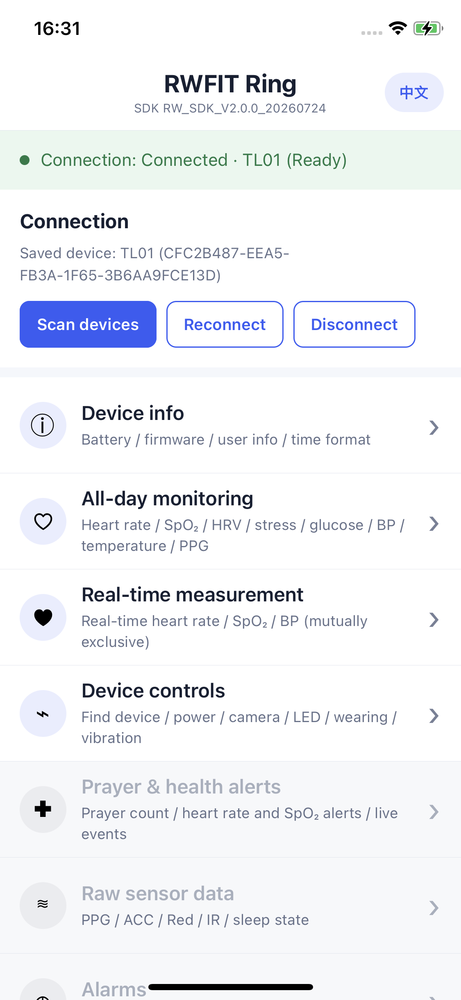

# react-native-rwfit-ble

React Native TurboModule for the RWFIT BLE SDK. Android and iOS share one
TypeScript API with normalized fields, units, events, and error behavior.

This module is built against native SDK version
`RW_SDK_V2.0.0_20260724` on both Android and iOS.

## Demo preview

<p align="center">
  
</p>

## Requirements

- React Native `0.86.x` with the New Architecture enabled
- RWFIT native SDK `RW_SDK_V2.0.0_20260724`
- Node.js `22.11.0+`
- Android minSdk 26
- iOS 12.0+ on a physical arm64 device

The bundled iOS `DHBleSDK.framework` contains only an iPhoneOS arm64 slice,
so the iOS Simulator is not supported.

## Installation

Install a tagged GitHub release:

```sh
npm install github:RWFitSDK/rw-react-native-sdk#v0.0.3
```

Or add it directly to the application's `package.json`:

```json
{
  "dependencies": {
    "react-native-rwfit-ble": "github:RWFitSDK/rw-react-native-sdk#v0.0.3"
  }
}
```

The module uses React Native Autolinking. Do not manually register an Android
package or iOS pod.

For iOS, install pods after adding the dependency:

```sh
cd ios
pod install
```

## Documentation

- [Chinese integration guide](docs/integration_guide_zh.md)
- [English integration guide](docs/integration_guide_en.md)

The guides cover Android and iOS configuration, runtime permissions, scanning,
connection, device capability checks, API usage, event cleanup, and error
handling. The repository also includes a runnable React Native application in
`example/`.

## Development

```sh
npm install
npm run typecheck
npm test
npm pack --dry-run
```

Run the example:

```sh
cd example
npm install
npm start
```

In another terminal:

```sh
# Android
adb reverse tcp:8081 tcp:8081
npm run android

# iOS physical device (select your own signing team in Xcode first)
cd ios && pod install && cd ..
npm run ios -- --device "Your iPhone Name"
```

## License

MIT
